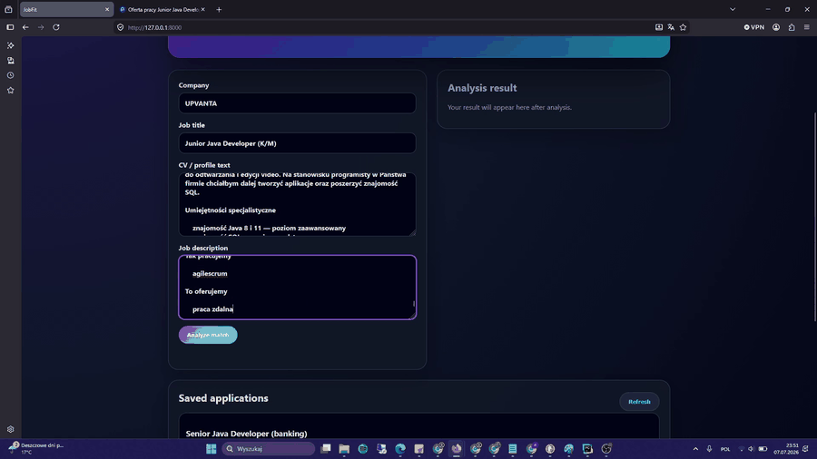

# JobFit AI

JobFit AI is a FastAPI-based web application that helps users analyze how well their CV matches a selected job offer and manage their recruitment process by tracking the status of their applications.

The application compares a CV with a job description, calculates a fit score, detects matched and missing skills, generates recommendations, prepares a short recruiter message, and allows users to monitor and update the status of their job applications.

## Demo

The GIF preview may take a few seconds to load. Please wait.

[](https://youtu.be/MKf9kwbWDHw)

[▶️ Zobacz pełne demo na YouTube](https://youtu.be/MKf9kwbWDHw)

Suggested flow for the GIF:

1. Open the application.
2. Paste a sample CV.
3. Paste a job offer.
4. Run the analysis.
5. Show the fit score, matched skills, missing skills and generated recruiter message.
6. Show the saved application in history and change its status.

## Features

* CV and job offer analysis
* Fit score calculation
* Matched skills detection
* Missing skills detection
* Recruiter message generation
* Job application history
* Application status management
* Simple responsive frontend
* REST API built with FastAPI
* SQLite database
* Layered backend architecture

## Tech Stack

### Backend

* Python
* FastAPI
* SQLAlchemy
* Pydantic
* SQLite
* Pytest

### Frontend

* HTML
* CSS
* JavaScript

## Project Structure

```text
job-fit-ai/
├── app/
│   ├── main.py
│   ├── database.py
│   ├── models.py
│   ├── schemas.py
│   ├── routers/
│   │   └── applications.py
│   ├── services/
│   │   ├── analyzer.py
│   │   └── application_service.py
│   └── repositories/
│       ├── company_repository.py
│       ├── job_offer_repository.py
│       ├── application_repository.py
│       └── analysis_repository.py
├── frontend/
│   ├── index.html
│   ├── style.css
│   └── script.js
├── tests/
├── requirements.txt
├── README.md
└── .gitignore
```

## Architecture

The backend is divided into several layers:

```text
Router → Service → Repository → Database
```

### Router

Handles HTTP requests and responses.

Example responsibilities:

* define API endpoints
* validate request body using Pydantic schemas
* return proper HTTP responses

### Service

Contains business logic.

Example responsibilities:

* create a complete job application flow
* trigger CV/job offer analysis
* prepare response data for the API

### Repository

Contains database operations.

Example responsibilities:

* create records
* fetch records
* update application status
* load related database objects

### Models

Define database tables and relationships.

Main database structure:

```text
Company 1 --- N JobOffer
JobOffer 1 --- N JobApplication
JobApplication 1 --- 1 AnalysisResult
```

## How the Analysis Works

The analysis is based on automated text processing. The application does not use a paid external AI API in the current version.

The process works as follows:

### 1. Text normalization

The CV and job offer are converted to a normalized format:

* lowercase text
* simplified spacing
* easier keyword matching

### 2. Skill extraction

The application uses a predefined technology keyword list, for example:

```text
python, fastapi, sql, docker, git, react, machine learning, pandas
```

It searches for these technologies in both the CV and the job offer.

The analyzer also supports aliases. For example:

```text
postgres → postgresql
sklearn → scikit-learn
restful api → rest api
```

### 3. Matched skills

Matched skills are technologies that appear both in the CV and in the job offer.

Example:

```text
CV: python, fastapi, sql
Job offer: python, fastapi, docker
Matched: python, fastapi
```

### 4. Missing skills

Missing skills are technologies required in the job offer but not found in the CV.

Example:

```text
CV: python, fastapi
Job offer: python, fastapi, docker
Missing: docker
```

### 5. Skill coverage score

Skill coverage checks how many required skills from the job offer are covered by the CV.

Example:

```text
Matched skills: 4
Required skills: 8
Skill coverage: 50%
```

### 6. Text similarity score

The application also compares the general similarity between the CV text and the job description.

This helps detect whether the CV and the job offer are related even beyond direct keyword matches.

### 7. Final fit score

The final fit score combines:

* skill coverage
* text similarity
* number of matched and missing keywords

The result is shown as a percentage.

### 8. Recommendations

Based on missing keywords, the application generates simple recommendations, for example:

```text
Consider adding Docker to your CV if you have practical experience with it.
```

### 9. Recruiter message

The application generates a short message that can be used when contacting a recruiter.

## API Endpoints

### Analyze and save application

```http
POST /api/applications/analyze
```

Creates a company if needed, creates a job offer, creates an application, performs the analysis and saves the result.

### List applications

```http
GET /api/applications
```

Returns saved applications with their analysis results.

### Update application status

```http
PATCH /api/applications/{application_id}/status
```

Updates the status of a selected application.

Allowed statuses:

```text
saved
applied
interview
rejected
offer
```

### Health check

```http
GET /health
```

Returns basic application status.

## Installation

Clone the repository:

```bash
git clone https://github.com/your-username/job-fit-ai.git
cd job-fit-ai
```

Create virtual environment:

```bash
python -m venv venv
```

Activate virtual environment on Windows:

```bash
venv\Scripts\activate
```

Install dependencies:

```bash
pip install -r requirements.txt
```

Run the application:

```bash
uvicorn app.main:app --reload
```

Open the app:

```text
http://127.0.0.1:8000
```

Open API documentation:

```text
http://127.0.0.1:8000/docs
```

## Running Tests

```bash
pytest
```

## Database

The current version uses SQLite.

Database file:

```text
jobfit.db
```

The database is created automatically when the application starts.

Current tables:

```text
companies
job_offers
job_applications
analysis_results
```

## Security Notes

The frontend avoids directly inserting untrusted API data into the DOM without escaping.

Backend validation is handled with Pydantic schemas.

Future improvements should include:

* user authentication
* authorization
* ownership checks
* CSRF protection if cookie-based auth is added

## Current Limitations

* No user accounts yet
* All applications are stored globally
* Technology detection is based on a predefined keyword list
* No external LLM API integration yet
* SQLite is used instead of PostgreSQL
* Company management is not yet exposed as a separate API resource

## TODO

* [ ] Improve CV matching algorithm (e.g. weighted scoring, semantic similarity, context-aware keyword detection, and better handling of experience levels)

  * [ ] Replace single keyword list with a modular technology dataset (merged from multiple categorized files such as backend, frontend, DevOps, data, etc.)
* [ ] Add user registration and login
* [ ] Add JWT authentication
* [ ] Add `user_id` to job applications
* [ ] Add full company management:

  * [ ] `POST /companies`
  * [ ] `GET /companies`
  * [ ] `GET /companies/{id}`
  * [ ] `PATCH /companies/{id}`
  * [ ] `DELETE /companies/{id}`
* [ ] Add job offer management as a separate resource
* [ ] Move technology keywords to external JSON file
* [ ] Expand technology taxonomy for Java, .NET, frontend, DevOps and data roles
* [ ] Add PostgreSQL support
* [ ] Add Alembic migrations
* [ ] Add Docker Compose
* [ ] Add more backend tests
* [ ] Add frontend validation improvements
* [ ] Add optional LLM-based recruiter message generation

## Why I Built This Project

This project was created to solve a real problem I faced while applying for junior IT positions: quickly checking how well my CV matches different job offers and tracking the status of my applications.

JobFit AI automates CV-job offer comparison, detects matched and missing skills, calculates a fit score, and helps manage the recruitment process.
It combines:

* REST API design
* database modeling
* SQLAlchemy relationships
* layered backend architecture
* frontend integration
* automated text analysis
* practical job search use case

## License

This project is for educational and portfolio purposes.
